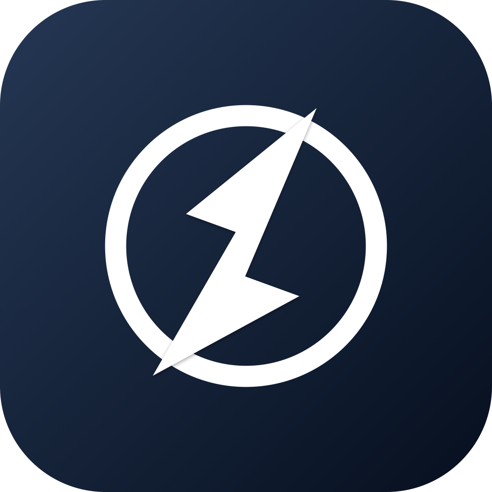
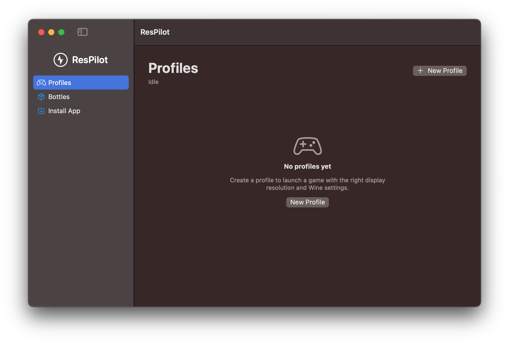
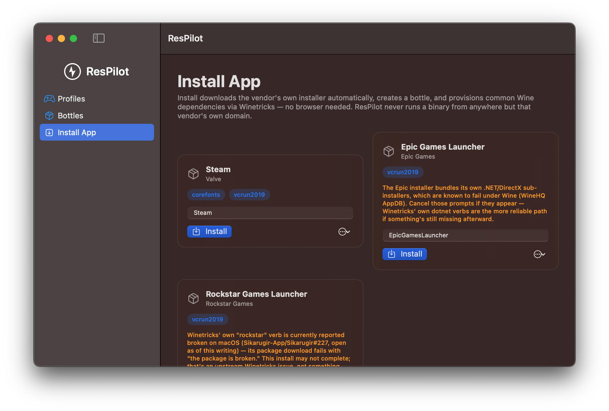

<div align="center">



# ResPilot

### Run Windows games and apps on Mac — free, no CrossOver required

**ResPilot is a free, open-source Windows-app runner for macOS.** It bundles its own free Wine engine, so you can play Steam, Epic Games, and Rockstar Games titles — or run any Windows `.exe` — on Apple Silicon or Intel Macs with one click, automatic display/HiDPI switching per game, and zero telemetry. No CrossOver purchase, no Wineskin wrapper, no Homebrew required.

[](LICENSE)
[](#requirements)
[](#requirements)
[](Package.swift)
[](Package.swift)
[](Tests/ResPilotCoreTests)

**[⬇ Download for macOS](#installation)** · **[How to run a game](#how-to-run-a-game)** · [Features](#features) · [CLI Reference](#cli-reference) · [Troubleshooting](#troubleshooting) · [FAQ](#faq)

</div>

---

## Table of contents

- [Why ResPilot exists](#why-respilot-exists)
- [Screenshots](#screenshots)
- [Features](#features)
- [How ResPilot compares to CrossOver, Whisky, and Wineskin](#how-respilot-compares)
- [Requirements](#requirements)
- [Installation](#installation)
  - [Option 1: Download the app (recommended)](#option-1-download-the-app-recommended)
  - [Option 2: Build from source](#option-2-build-from-source)
  - [Uninstalling](#uninstalling)
- [How to run a game](#how-to-run-a-game)
  - [One-click install: Steam (Epic/Rockstar currently blocked upstream)](#one-click-install-steam-epic-games-and-rockstar-games-currently-blocked-upstream)
  - [Create a profile for a game you already own](#create-a-profile-for-a-game-you-already-own)
  - [Launching and quitting](#launching-and-quitting)
- [CLI reference](#cli-reference)
- [Troubleshooting](#troubleshooting)
- [Architecture](#architecture)
- [FAQ](#faq)
- [Contributing](#contributing)
- [Acknowledgments](#acknowledgments)
- [License](#license)

---

## Why ResPilot exists

Searching for **"CrossOver alternative"**, **"CrossOver for free"**, or **"how to run Windows games on Mac for free"**? ResPilot ships its own Wine engine — a pinned, sha256-verified build of upstream [WineHQ](https://www.winehq.org/) (GNU LGPL v2.1+, via [Gcenx/macOS_Wine_builds](https://github.com/Gcenx/macOS_Wine_builds), the same free build Homebrew's own `wine@staging` cask installs) — downloaded once, on demand, straight from ResPilot itself. **No CrossOver purchase, no CrossOver trial, no Wineskin Winery wrapper, no Homebrew — nothing else to install first, for anything ResPilot does, including one-click Steam/Epic/Rockstar installs.**

What that free engine gets you is genuine, but it isn't CrossOver's engine: CrossOver (CodeWeavers) sells a *patched* Wine build plus paid per-app compatibility QA, and Wineskin/Kegworks/Sikarugir wrap that same free WineHQ lineage in a hand-built `.app`. ResPilot's bundled engine is the same free lineage those wrappers use, with none of CrossOver's proprietary patches — so treat "will my game run" the same way you would for any vanilla-Wine setup, and check the game's [WineHQ AppDB](https://appdb.winehq.org/) or community compatibility notes rather than assuming CrossOver-grade support.

Already have a CrossOver bottle or a Wineskin-style wrapped app? ResPilot discovers and manages those too (per-game profiles, display/HiDPI switching, launching) — it's additive, never a replacement for a setup you already have.

What ResPilot **also** replaces is the tedious, manual part every Wine-on-Mac setup leaves to you: remembering to switch your Mac's display resolution before launching a game, hand-editing Wine's registry for HiDPI and DPI scaling, hunting down a Steam/Epic/Rockstar installer and clicking through Winetricks dependencies by hand, and doing all of that again for every single game. ResPilot automates it — for free, open-source, with zero telemetry.

## Screenshots

<p align="center">
  
  
</p>

## Features

- 🍷 **Bundled free Wine engine, no external install** — `respilot install-app` (or the GUI's Install App tab) downloads a pinned, sha256-verified [WineHQ](https://www.winehq.org/) build (GNU LGPL v2.1+) to its own support directory the first time it's needed, ~190MB, once — no CrossOver purchase/trial, no Wineskin Winery, no Homebrew.
- 🖥️ **Automatic display/HiDPI switching** — pick the exact resolution and DPI scale a game wants; ResPilot switches your Mac's display mode right before launch and restores it the instant the game quits (even if you force-quit — a background watcher and a persisted breadcrumb guarantee the restore, and a menu bar "Restore Display Now" button is always one click away).
- 🎮 **Per-game Wine profiles** — save bottle, launch target, display mode, RetinaMode, LogPixels (DPI), and Wine renderer/ESync/MSync settings once per game; launch with one click or `respilot launch` forever after.
- 📦 **Bottle discovery across three lineages** — finds its own self-managed bottles, CrossOver bottles (`~/Library/Application Support/CrossOver/Bottles`), *and* Wineskin/Kegworks/Sikarugir-style wrapped `.app`s automatically, no manual path entry.
- ⬇️ **One-click bottle creation and provisioning** — for Steam, Epic Games Launcher, and Rockstar Games Launcher: ResPilot creates a fresh bottle against its own engine, downloads the vendor's *own* installer directly from the vendor's *own* domain (never a mirror, never repackaged), and provisions the Winetricks dependencies each one needs — no browser, no manual download-and-drag, no other app to install first. **Steam's installer completes end-to-end**, confirmed live; Epic Games Launcher and Rockstar Games Launcher currently hit known upstream Wine bugs partway through (see [Troubleshooting](#troubleshooting)) — that's Wine/vendor-installer compatibility, not something ResPilot's own pipeline can route around yet.
- 🧰 **CLI + native SwiftUI GUI** — script it in CI/automation with `respilot`, or drive it from a proper macOS menu bar app and window.
- 🔓 **No lock-in, no telemetry, MIT-licensed** — reads and writes standard Wine registry files via `wine`/`wineboot`/CrossOver's own `cxbottle` tooling; nothing proprietary, nothing phoning home, nothing tracked.
- 💻 **Apple Silicon and Intel** — runs natively on M-series Macs (the bundled Wine engine runs under Rosetta 2, installed automatically by macOS if needed) and on Intel Macs.

## How ResPilot compares

| | **CrossOver** | **Whisky** | **Wineskin/Kegworks** | **ResPilot** |
|---|---|---|---|---|
| Wine engine | ✅ (paid, patched) | ✅ (free) | ✅ (free) | ✅ — bundles free WineHQ (LGPL), auto-downloaded |
| Price | Paid (~$74, 14-day trial) | Free | Free | **Free, MIT** |
| Bottle creation UI | ✅ | ✅ | ✅ | ✅ — self-managed, or delegates to CrossOver's `cxbottle` if you point it there |
| Automatic display/HiDPI switching per game | ❌ | ❌ | ❌ | ✅ |
| One-click Steam install | ❌ (manual) | ❌ (manual) | ❌ (manual) | ✅ — no external app required |
| CLI | ❌ | ❌ | ❌ | ✅ |
| Open source | ❌ | ✅ | ✅ | ✅ |

**In short:** ResPilot needs nothing else installed first. If you already have a CrossOver trial or a Wineskin wrapper, it discovers and manages those too — but it doesn't require either.

## Requirements

- macOS 13 (Ventura) or later — Apple Silicon (M1/M2/M3/M4) or Intel
- Nothing else — `respilot install-app` / `respilot install-engine` fetches ResPilot's own free Wine engine on first use. On Apple Silicon this engine runs under [Rosetta 2](https://support.apple.com/en-us/102527) (an x86_64 build — no arm64-native WineHQ macOS package exists yet); macOS prompts to install Rosetta automatically the first time it's needed if it isn't already present.
- **Optional:** [CrossOver](https://www.codeweavers.com/crossover) or a [Wineskin Winery](https://github.com/Gcenx/WineskinServer)/Kegworks/Sikarugir-wrapped app, if you already have bottles there you want ResPilot to manage alongside its own.

## Installation

### Option 1: Download the app (recommended)

1. Go to the **[Releases page](../../releases/latest)** and download `ResPilot.app.zip`.
2. Unzip it (double-click in Finder, or `unzip ResPilot.app.zip` in Terminal).
3. Drag `ResPilot.app` into your **Applications** folder.
4. **First launch:** macOS Gatekeeper blocks unsigned apps (ResPilot doesn't have a paid Apple Developer certificate yet). You'll see *"ResPilot.app" can't be opened because Apple cannot check it for malicious software* — this is expected for any free, open-source Mac app without a $99/year Apple Developer certificate. Two ways past it:
   - **Right-click (or Control-click) `ResPilot.app` → Open → Open** — a one-time confirmation, no Terminal needed.
   - **Or run this once in Terminal:**
     ```bash
     xattr -cr /Applications/ResPilot.app
     ```
5. Launch **ResPilot** from Applications or Spotlight (⌘Space, type "ResPilot"). It appears in both the Dock and the menu bar.

That's it — no CrossOver install, no Wineskin Winery, no Homebrew step. The free Wine engine downloads automatically the first time you use **Install App** (see [How to run a game](#how-to-run-a-game) below).

### Option 2: Build from source

Requires Xcode Command Line Tools (`xcode-select --install`) for the Swift 5.10+ toolchain.

```bash
git clone https://github.com/akayyt786/respilot.git
cd respilot
swift build -c release
sh Scripts/build-app-bundle.sh release
open .build/release/ResPilot.app
```

To install the built app permanently:

```bash
cp -R .build/release/ResPilot.app /Applications/
xattr -cr /Applications/ResPilot.app
```

Or build just the command-line tool:

```bash
swift build -c release --product respilot
.build/release/respilot help
```

> **Note:** if `swift build` reports `accessing build database: disk I/O error` inside a cloud-synced folder (iCloud Drive, Dropbox, Google Drive, etc.), redirect the build cache out of the synced folder: `swift build -c release --build-path /tmp/respilot-build`.

### Uninstalling

ResPilot never writes outside its own sandboxed support directory, so removal is clean:

```bash
rm -rf /Applications/ResPilot.app
rm -rf ~/Library/Application\ Support/ResPilot
```

The second command also removes any bottles, profiles, and the downloaded Wine engine ResPilot created. Skip it if you want to keep your game bottles for later.

## How to run a game

### One-click install: Steam (Epic Games and Rockstar Games currently blocked upstream)

1. Open **ResPilot** → click **Install App** in the sidebar.
2. Pick **Steam**, type a bottle name (or keep the default), and click **Install**. (Epic Games Launcher and Rockstar Games Launcher are also listed and will run the same pipeline, but currently hit known upstream Wine bugs partway through and won't finish installing — see [Troubleshooting](#troubleshooting) for exactly where and why.)
3. **First install only:** ResPilot downloads its free Wine engine first (~190MB, one-time — you'll see "Downloading free Wine engine…" in the status line). Every install after that skips straight to the next step.
4. ResPilot downloads Steam's real installer directly from Valve's own domain, creates a fresh Wine bottle, provisions the Winetricks dependencies it needs (fonts, Visual C++ runtimes), and runs the installer — finish it exactly like you would on Windows.
5. Once Steam is installed inside the bottle, open **Profiles → New Profile**, pick the bottle you just created, and point **Launch target** at `Steam.exe` (or the `.app` if one was created) to finish setting up a one-click launch profile with display/HiDPI settings.

### Create a profile for a game you already own

Already have a Windows game installer, or a bottle from CrossOver/Wineskin?

1. Open **Profiles** → **New Profile**.
2. Choose the bottle type: **ResPilot** (its own free engine), **CrossOver**, or **Sikarugir/Wineskin** — pick from auto-discovered bottles, or enter one manually.
3. Set the **Launch target**: an installed `.app`, or a raw `.exe` inside the bottle.
4. Turn on **Change macOS display resolution** if the game wants a specific resolution/HiDPI mode, and set **Wine RetinaMode** and **DPI scaling** to match.
5. Optionally toggle **ESync**/**MSync** or a specific Wine renderer (`gl`/`vulkan`/`gdi`) under Compatibility.
6. Click **Save**.

### Launching and quitting

Click a profile's **Launch** button (from the **Profiles** tab or the menu bar). ResPilot:

1. Writes the profile's Wine registry settings (RetinaMode, LogPixels, renderer, ESync/MSync).
2. Switches your Mac's display resolution, if the profile asks for one.
3. Launches the game/app.
4. Watches in the background — the instant the game quits (even a force-quit), your display reverts automatically. A menu bar **Restore Display Now** button is always available as a manual fallback.

## CLI reference

```
respilot list-displays                                  Show current + available display modes
respilot list-bottles                                    Discover ResPilot-managed + CrossOver + Wineskin-style bottles
respilot list-apps                                        One-click install catalog (Steam, Epic, Rockstar)
respilot list-profiles                                    List saved profiles
respilot show-profile --name <name>                       Full profile detail
respilot add-profile --name <name> --kind respilot|crossover|wineskin --bottle-name <name> \
  (--launch-app <path> | --launch-exe <path>) [--retina-mode on|off] [--dpi <LogPixels>] \
  [--display-width <n> --display-height <n> [--hidpi]] [--auto-revert on|off]
respilot remove-profile --name <name>
respilot apply --name <name>                              Apply a profile's display/Wine settings and launch
respilot restore                                          Restore display now (safe to call anytime)
respilot install-app --app steam|epic|rockstar --bottle-name <name> [--installer <path>] [--dry-run]
respilot install-engine                                   Downloads ResPilot's free Wine engine ahead of time
```

Environment: `RESPILOT_HOME` overrides where `profiles.json` / `pending-restore.json` live (default: `~/Library/Application Support/ResPilot`).

## Troubleshooting

**"ResPilot.app" can't be opened because Apple cannot check it for malicious software**
Expected for an unsigned open-source app. Right-click → **Open** → **Open**, or run `xattr -cr /Applications/ResPilot.app` in Terminal. See [Installation](#option-1-download-the-app-recommended) above.

**Install App shows "No CrossOver.app found" / a CrossOver warning**
You're running an old build. Update to the latest release — current versions never require CrossOver for `Install App`; they download ResPilot's own free engine automatically.

**First install is slow / stuck on "Downloading free Wine engine…"**
Normal on the very first `Install App` or `respilot install-engine` run — it's a ~190MB one-time download. Every install after that skips it. Check your internet connection if it never progresses.

**A game/launcher won't start, or crashes on launch**
This is a Wine/game compatibility issue, not specific to ResPilot — the same class of problem you'd hit under vanilla Wine, Wineskin, or CrossOver. Check the app's [WineHQ AppDB](https://appdb.winehq.org/) entry for known workarounds and required Winetricks verbs first.

**Epic Games Launcher currently does not complete installing**
Reproduced and confirmed against a real bottle: two independent, unrelated upstream Wine bugs block it back-to-back, and clicking past the first one just leads to the second.
1. The installer verifies its embedded MSI payload's Authenticode signature and fails with `Certificate CN does not match 'Epic Games Inc.'`, because a fresh Wine bottle's certificate store ships with no root CAs. Long-standing Wine/WinTrust limitation, no reliable Winetricks or registry fix exists. ([wine-devel thread](https://www.winehq.org/pipermail/wine-devel/2016-October/115023.html))
2. Past that, the installer's .NET components crash Wine's built-in Mono runtime (`wine-mono-11.1.0/.../gmisc-win32.c: assertion 'filename != NULL' failed`) — tracked upstream ([lutris/lutris#6690](https://github.com/lutris/lutris/issues/6690)); the real fix needs a standalone Mono MSI installed into the bottle, not a Winetricks verb.

Neither is a ResPilot bug, and Steam/Rockstar Games Launcher don't hit either one (different installer technology). **Steam is confirmed working end-to-end** — use that if you want a one-click install that actually completes today.

**Rockstar Games Launcher install fails with "the package is broken"**
Winetricks' own `rockstar` verb is currently broken on macOS upstream ([Sikarugir-App/Sikarugir#227](https://github.com/Sikarugir-App/Sikarugir/issues/227)) — not something ResPilot can route around until upstream fixes it.

**`swift build` fails with `accessing build database: disk I/O error`**
A local toolchain/filesystem interaction seen inside cloud-synced folders (iCloud Drive Desktop & Downloads sync, Dropbox, Google Drive, etc.) — not a ResPilot code issue. Redirect the build cache: `swift build --build-path /tmp/respilot-build -c release`.

**Display doesn't revert after quitting a game**
Open ResPilot's menu bar item and click **Restore Display Now** — safe to click anytime, a no-op if nothing is pending. If it keeps happening, check whether **Auto-revert on quit** is enabled on that profile.

Still stuck? [Open an issue](../../issues/new) with your macOS version, Mac chip (Apple Silicon or Intel), and the exact command/steps you ran.

## Architecture

- **`ResPilotCore`** — all Wine/display/process logic, zero UI dependencies. Fully unit-tested (106 tests) against protocol-based fakes for process execution, display mode, downloads, and app launching, so the actual invocation shape of every `wine`/`wineboot`/`cxbottle`/Winetricks call is asserted, not assumed.
- **`ResPilotApp`** — the SwiftUI menu bar + window app, a thin adapter over `ResPilotCore`.
- **`respilot-cli`** — a Swift Argument Parser-free, dependency-free CLI over the same core.

Every external tool ResPilot shells out to (`wine`/`wine64`, `wineboot`, `cxbottle`, [Winetricks](https://github.com/Winetricks/winetricks)) is invoked exactly the way upstream Wine/CodeWeavers/Winetricks document, verified against a real install rather than assumed — see the doc comments in `Sources/ResPilotCore` for the specific quirks (CrossOver's shared `wine` binary needing `--bottle <name>` addressing vs. plain `WINEPREFIX` for a self-managed or Wineskin-style bottle, its Perl-wrapper `wine` needing `WINE_BIN`/`WINESERVER_BIN` pointed at the real Mach-O binaries for Winetricks' own arch auto-detection, `--template win10_64` / `WINEARCH=win64` being required for a WOW64-layout bottle either way, etc.). `WineEngineManager` downloads, sha256-verifies, and extracts ResPilot's own pinned WineHQ release (see its doc comment for the exact version/license) — never bundled in the repo or app, fetched once on demand.

## FAQ

**Is ResPilot a free CrossOver alternative?**
For running Windows software on macOS, yes: ResPilot bundles its own free Wine engine (upstream WineHQ, GNU LGPL v2.1+) and needs nothing else installed. What it *isn't* is a CrossOver-quality alternative — CrossOver sells CodeWeavers' own patched Wine build and paid per-app compatibility QA that ResPilot's vanilla engine doesn't have. If a game needs CrossOver-specific patches, ResPilot can also manage a real CrossOver bottle if you have one; it just doesn't require it anymore.

**Can I use ResPilot without CrossOver or Wineskin?**
Yes — for everything, including the one-click **Install App** catalog. ResPilot downloads and manages its own Wine engine (`respilot install-engine`, or automatically on first `install-app`) so no other app needs to be installed first. CrossOver and Wineskin-style wrapped apps are still discovered and manageable if you already have them.

**Does ResPilot work on Apple Silicon (M1/M2/M3/M4) Macs?**
Yes. ResPilot itself is a native Apple Silicon Swift app. Its bundled Wine engine is currently an x86_64 build (no arm64-native WineHQ macOS package exists yet) and runs under Rosetta 2, which macOS installs automatically the first time it's needed.

**Does ResPilot download or bundle any game or app binaries?**
No. `Install App` downloads each vendor's own installer directly from that vendor's own domain, at install time, verified live; the Wine engine itself is a pinned, sha256-verified WineHQ release fetched from its own GitHub releases — nothing is bundled, mirrored, or redistributed in this repo.

**Will this get me banned from Steam/Epic/Rockstar?**
ResPilot doesn't modify or interact with anti-cheat or account systems; it's just a bottle/display manager. That said, running any game under Wine carries the same anti-cheat compatibility risk running it any other way under Wine does — check the game's own Wine/CrossOver compatibility status first.

**Is ResPilot safe? Does it collect any data?**
ResPilot has zero telemetry and no network calls except: downloading its own Wine engine (from GitHub, checksum-verified), downloading Winetricks (from its own GitHub repo), and downloading a game launcher's installer directly from that vendor's domain when you click Install. Nothing is ever sent back anywhere. It's fully open source — read the code yourself.

**How do I update ResPilot?**
Download the latest `ResPilot.app.zip` from [Releases](../../releases) and drag it over the old copy in Applications — your profiles and bottles (stored in `~/Library/Application Support/ResPilot`) are untouched by an app update.

## Contributing

Issues and PRs welcome. The test suite (`swift test`) is the contract — a change that doesn't come with (or update) tests covering it won't be considered complete.

## Acknowledgments

- [The Wine Project](https://www.winehq.org/) (GNU LGPL v2.1+) — the actual compatibility layer this all sits on top of, and [CodeWeavers CrossOver](https://www.codeweavers.com/crossover), whose patched build and bottle tooling ResPilot also supports.
- [Gcenx/macOS_Wine_builds](https://github.com/Gcenx/macOS_Wine_builds) — the free, community-maintained macOS packaging of upstream WineHQ that `WineEngineManager` downloads (the same build Homebrew's `wine@staging` cask installs — deliberately not `wine-stable`, which fails to boot on Apple Silicon macOS Sequoia; see `WineEngineManager`'s doc comment).
- [Winetricks](https://github.com/Winetricks/winetricks) (GNU LGPL v2.1) — the dependency installer ResPilot shells out to, exactly the way Bottles, Lutris, and Sikarugir do.
- [Wineskin Winery](https://github.com/Gcenx/WineskinServer) / Kegworks / Sikarugir — the free wrapper-app lineage ResPilot also discovers and manages.

## License

[MIT](LICENSE) — see `LICENSE`.
